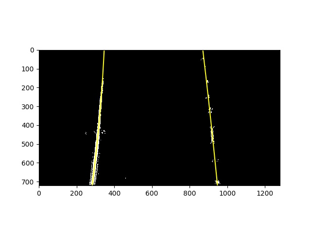
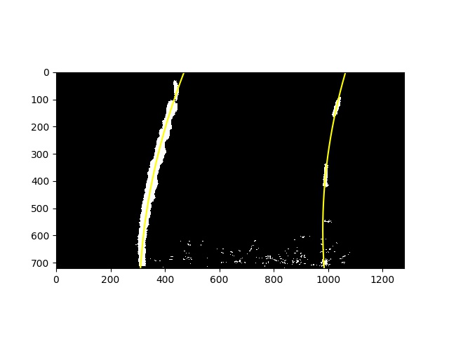
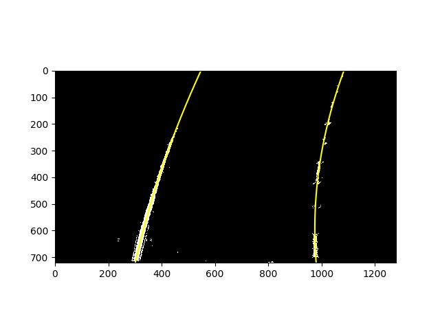
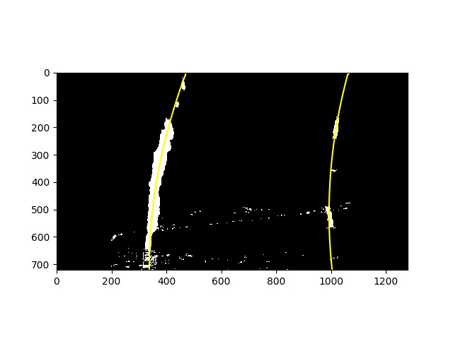
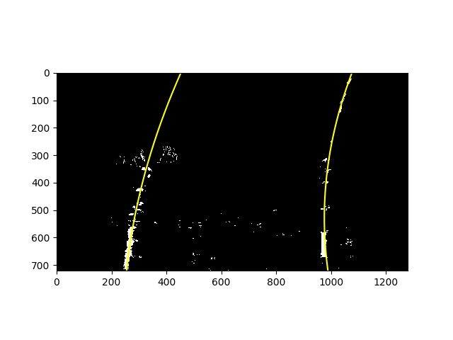
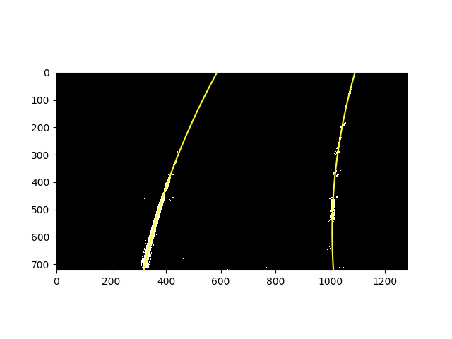

# **Advanced Lane Finding Project**

The goals / steps of this project are the following:

* Compute the camera calibration matrix and distortion coefficients given a set of chessboard images.
* Apply a distortion correction to raw images.
* Use color transforms, gradients, etc., to create a thresholded binary image.
* Apply a perspective transform to rectify binary image ("birds-eye view").
* Detect lane pixels and fit to find the lane boundary.
* Determine the curvature of the lane and vehicle position with respect to center.
* Warp the detected lane boundaries back onto the original image.
* Output visual display of the lane boundaries and numerical estimation of lane curvature and vehicle position.

---

### Camera Calibration

The code for this step is contained in the code cell #2 of the IPython notebook located in "AdvancedLaneLines.ipynb".  

I start by preparing "object points", which will be the (x, y, z) coordinates of the chessboard corners in the world. Here I am assuming the chessboard is fixed on the (x, y) plane at z=0, such that the object points are the same for each calibration image.  Thus, `objp` is just a replicated array of coordinates, and `objpoints` will be appended with a copy of it every time I successfully detect all chessboard corners in a test image. `imgpoints` will be appended with the (x, y) pixel position of each of the corners in the image plane with each successful chessboard detection.  

As recommended I used chessboard size of 9x6.

I then used the output `objpoints` and `imgpoints` to compute the camera calibration and distortion coefficients using the `cv2.calibrateCamera()` function.  I applied this distortion correction to the test image using the `cv2.undistort()` function and obtained this result: 


### Pipeline (single images)

#### 1. Example of a distortion-corrected images.

To demonstrate this step, I will describe how I apply the distortion correction to one of the test images like this one:


#### 2. Description of transformation process and an example of a binary image result.

I used a combination of color and gradient thresholds to generate a binary image (thresholding steps in a function `pipeline()` in cell #7. For color channel I used S-channel of HLS color space.  Here's an example of my output for this step.

After first submit and recommendations from reviewer I've added also gray-scalling channel and magnitude and direction gradient. 


#### 3. Descrition of performing a perspective transform and an example of a transformed image.

For perspective transformation I hardcoded the source and destination points in the following manner (describe left and right lane marking before and after transformation):

```python
# Points on original image
src = np.float32(
    #Top point of left lane marking line
    [[(img_size[0] / 2) - 50, img_size[1] / 2 + 90],
    #Bottom point of left lane marking line
    [img_size[0] / 5, img_size[1]],
    #Bottom point of left lane marking line
    [(img_size[0] * 5 / 6) + 50, img_size[1]],
    #Top point of left lane marking line
    [(img_size[0] / 2 + 60), img_size[1] / 2 + 90]])
# Points on transformed image
dst = np.float32(
    [[(img_size[0] / 4), 0],
    [(img_size[0] / 4), img_size[1]],
    [(img_size[0] * 3 / 4), img_size[1]],
    [(img_size[0] * 3 / 4), 0]])
```

This resulted in the following source and destination points:

| Source        | Destination   | 
|:-------------:|:-------------:| 
| 590, 450      | 320, 0        | 
| 256, 720      | 320, 720      |
| 1117, 720     | 960, 720      |
| 700, 450      | 960, 0        |

I verified that my perspective transform was working as expected by drawing the `src` and `dst` points onto a test image and its warped counterpart to verify that the lines appear parallel in the warped image.


#### 4. Description of identifying lane-line pixels

First I identified a region of interest by defining some extents from the left and right borders of image:
```python
    left_bottom = [200, ysize]
    right_bottom = [xsize - 200, ysize]
    left_top = [200, 0]
    right_top = [xsize - 200, 0]
    vertices = np.array([[(left_bottom[0], left_bottom[1]), 
                          (left_top[0], left_top[1]), 
                          (right_top[0], right_top[1]),
                          (right_bottom[0], right_bottom[1])]], dtype=np.int32)
    
    binary_warped = region_of_interest(binary_warped, vertices)
```

then I found the maximums of non zero pixels on left and right sides (for left/right lanes).
If previous frame was successful I used stored values to define start positions.
Specifying a minimal number of pixels I tried to find this number of non zero pixels in each area, if it is unsuccessful, I dropped out stored values and start from scratch (histogramm). If I didn't find any minimal set of pixels I skipped those image/frame.

Then I fit my lane lines with a 2nd order polynomial kinda like this:
(in first submit there was one exception case with bad results, now everything is OK)









#### 5. Description of curvature calculation.

Knowing, that curve is a polynom of order 2:

I used following formula to evaluate a curvature radius:


I did this in followinf lines and evaluate radius for the most bottom point of curve.
```python
    #Evaluate radiuses of curvature
    y_eval = np.max(ploty)
    # Fit new polynomials to x,y in world space
    left_fit_cr = np.polyfit(left_y*ym_per_pix, left_x*xm_per_pix, 2)
    right_fit_cr = np.polyfit(right_y*ym_per_pix, right_x*xm_per_pix, 2)
    # Calculate the new radii of curvature
    left_curverad = ((1 + (2*left_fit_cr[0]*y_eval*ym_per_pix + left_fit_cr[1])**2)**1.5) / np.absolute(2*left_fit_cr[0])
    right_curverad = ((1 + (2*right_fit_cr[0]*y_eval*ym_per_pix + right_fit_cr[1])**2)**1.5) / np.absolute(2*right_fit_cr[0])
```
Then I checked difference in curve directions by evaluating differences between a-coefficients of polynoms, maximal distance between two curves and special use cases if curves are curved enough and did not directed into different directions (like on image above). 
If these conditions are reached I skipped results of this frame and use previous ones, stored in class `Line`.
For first frame if no previouc results are available I did filtering of curve parts from bottom side of image until the distance between curves is more than minimal configured value:
```python

            #No success before - generate some batch of data
            #Go from bottom to top until distance is more than minimal
            
            #First - reverse arrays to fo from bottom
            rev_left_fitx = np.flipud(left_fitx)
            rev_right_fitx = np.flipud(right_fitx)
            #Condition - minimal distance
            condition = np.subtract(rev_right_fitx, rev_left_fitx) >= min_distance_threshold
            #Extract sub arrays
            left_fitx = np.extract(condition, rev_left_fitx)
            right_fitx = np.extract(condition, rev_right_fitx)
            #Arrange y-values
            ploty = np.flipud(ploty)[:len(left_fitx)]
```

#### 6. An example image with plotted back the lane area.

I implemented this step in following lines in the function `process_frame()`. 
```python
    # Create an image to draw the lines on
    warp_zero = np.zeros_like(warped).astype(np.uint8)
    color_warp = warp_zero #np.dstack((warp_zero, warp_zero, warp_zero))
    # Recast the x and y points into usable format for cv2.fillPoly()
    if len(left_fitx) > 0 and len(right_fitx) > 0: 
        pts_left = np.array([np.transpose(np.vstack([left_fitx, ploty]))])
        pts_right = np.array([np.flipud(np.transpose(np.vstack([right_fitx, ploty])))])
        pts = np.hstack((pts_left, pts_right))
     
        #Define average curve radius
        curverad = np.average([left_curverad, right_curverad])
        #Define position by getting average between last elements of array (most bottom position)
        left_pos = left_fitx[-1]
        right_pos = right_fitx[-1]
        vehicle_pos = np.average([left_pos, right_pos]) 
        if (vehicle_pos < xsize / 2):
            pos_text = 'left of center'
        else:
            pos_text = 'right of center'
        pos_text = 'Vehicle is ' + "{:.2f}".format(vehicle_pos * xm_per_pix) + 'm ' + pos_text
        # Draw the lane onto t  he warped blank image
        cv2.fillPoly(color_warp, np.int_([pts]), (0, 255, 0))
        cv2.putText(undist, 'Radius of curvature = ' + "{:.2f}".format(curverad) + ' (m)', bottomLeftCornerOfText1, font, fontScale, fontColor, 2)
        cv2.putText(undist, pos_text, bottomLeftCornerOfText2, font, fontScale, fontColor, 2)
     
    # Warp the blank back to original image space using inverse perspective matrix (Minv)
    newwarp = cv2.warpPerspective(color_warp, Minv, (image.shape[1], image.shape[0])) 
    # Combine the result with the original image
    result = cv2.addWeighted(undist, 1, newwarp, 0.3, 0)
```

Here is an example of my result on a test image:


---

### Pipeline (video)

#### 1. Video output.

Here's a [link to my video result](./output_videos/project_video.mp4)

---

### Discussion

I used some snippets of code from Lesson directly, without tunning parameters or/and thresholds and got quite good result. 

1. First possibility to improve results of challenge videos is to tune thresholds or/and parameters I used in code such a minimal distance, differences in directions, maximal radius of curvature, etc.

2. Another possibility is trying iteractivly to use another channels (except S-channel) to choose the best result. Especially for hard-challenge video, where hardrail divider or curb were detected instead of lane marking.

Update after first submit:
1. I changed pipeline process of images by adding gray scale channel threshold and magnitude and direction gradient.
2. I added text output of evaluated curvature radius and car position
3. I did some other minor changes in code to improve results
  
